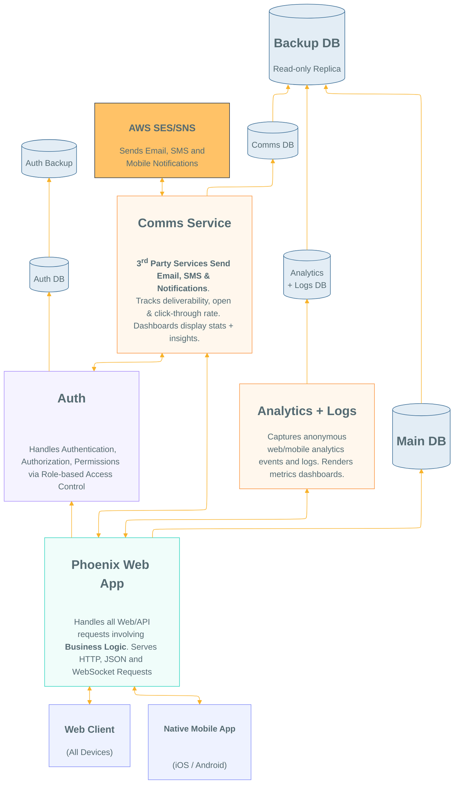

# Separation of Concerns Diagram

<!--
To Edit visit: 
https://docs.google.com/drawings/d/1ach2TPrH4Qhnvv1GjfU3lru-zT4ZpJEDjLdBliEm_9A/edit
-->

I _attempted_ to create the
diagram using `Mermaid`:

But sadly the renderer is **_non-deterministic_**
(i.e. we can't control the layout or position of elements)
See:
[dwyl/technology-stack#172](https://github.com/dwyl/technology-stack/issues/172#issuecomment-5220721045)