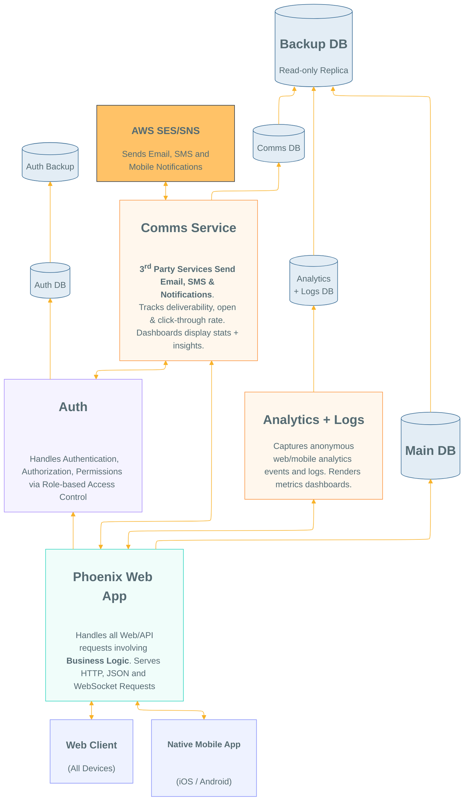

# Separation Of Concerns Into Services

We have built apps at/for companies
that went _full_ "**microservices**" e.g. `Uber`.
We found the complexity killed effectiveness
because almost any change required shipping code to 3 or more different repos.

However we do see the benefits
of separate services for specific functionality.

<!--
To Edit visit: 
https://docs.google.com/drawings/d/1ach2TPrH4Qhnvv1GjfU3lru-zT4ZpJEDjLdBliEm_9A/edit
-->

1. **`Web App`** owns all **Business Logic**
which connects to all other services
e.g: `Auth` whenever a specific function
e.g: `roles` or `permissions` query is required.
All “Transaction data” (owned by the business)
references a `user_id` owned by `Auth` service.
The **`Web App`** is the primary interface the people
(and other apps/agents) interact with,
and mediates access to the services layer.
If the `App` needs to send a "Payment Confirmation" email,
it sends that request to `Comms` and receives a `message_id`.

2. **Authentication/Authorization** functions
including storage of **personally identifiable information**
such as social security (NIF), Phone Number, email, (hashed) password,
**IP address** and location data,
should be stored on a **logically separate**
and highly secured database instance
which regular engineers never need to touch.
This adds much needed security for **_mitigating_ data breaches**.

3. **Analytics & Logging** - the lifeblood of any business -
is a separate service with it's own distinct backend.
We recommend running an instance of
[plausible.io](https://plausible.io/simple-web-analytics)
or paying for the hosted service (€19/month),
it includes all of the core features of **`Google Analytics`**
without the privacy concerns of leaking personal data.
Treating `Analytics` data as logically _separate_ from **`Business Logic`**
is best practice because it is not the core functionality of the business
so the service should not impact response times of requests for a booking.

4. **`Comms Service`** - We deploy a _separate_ **`Comms Service`**
for handling sending email, SMS and notifications.
This uses 3rd-party service
such as `AWS` or `Twilio` to handle the delivery.
Having Comms separate from App means regular engineers
never have access to the **`AWS` API Keys**
and cannot accidentally leak them (huge headache/cost).
The App code just calls the service with a simple request:
“**Send Booking Confirmed email to `user_id:123`**”.

5. **`Payments Service`** handles all payment requests by re-routing
them to the `Payment Provider`, in our case `Stripe`.
Having this service separate is again to avoid engineers having access
to **API Keys** or any sort of sensitive payment data.

6. **`API`** requests (`JSON` + `WebSockets`)
are handled by the **`Web App`**
without incurring additional complexity;
the same endpoints that render `HTML` can render `JSON`.
The same `Auth` and `WebSockets` used by the **`Web App`**
can be consumed natively by the **`Mobile App`**.
When the traffic volume justifies spinning up a dedicated API server,
it’s simply an additional instance without any incremental devops overhead.

I _attempted_ to create the
diagram using `Mermaid`:

But sadly the renderer is **_non-deterministic_**
(i.e. we can't control the layout or position of elements)
See:
[dwyl/technology-stack#172](https://github.com/dwyl/technology-stack/issues/172#issuecomment-5220721045)